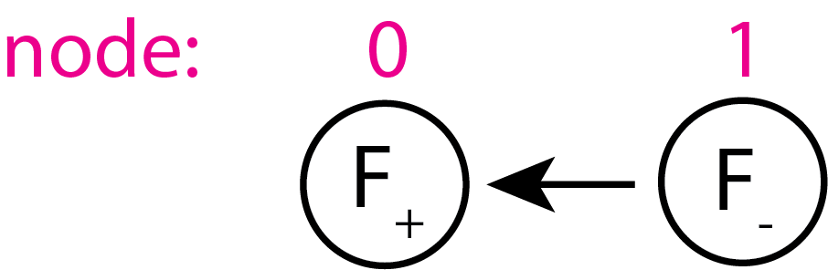
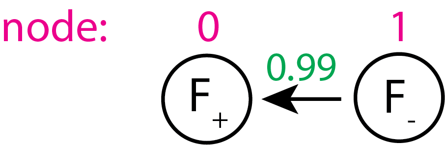

# NaI-soaked lysozyme

This folder contains instructions and scripts for processing a lysozyme anomalous dataset. Here, we
1. run `careless` with a bivariate prior, for many values of the double-Wilson `r` parameter, and then 
2. inspect merging statistics and anomalous differences.


We start with MTZ files found in `./unmerged_mtzs`. These were processed by Precognition v5.2.2 (Renz Research, Inc.)

## Configuring the bivariate prior
To run `careless`, we use the script `careless_runs/slurm-dw-array-grid.sh`, which starts a `slurm` batch array job. This job requires `careless_runs/slurm_params.txt`, in which we vary the double-Wilson `r` value across the individual `careless` runs.  To call using slurm: 

```
cd careless_runs
sbatch slurm-dw-array-grid.sh
```

Two flags in `slurm-dw-array-grid.sh` control the behavior of the bivariate prior:

```
CARELESS_ARGS+=(--double-wilson-parents=${DW_LIST}) 
CARELESS_ARGS+=(--double-wilson-r=${DWR_LIST})
```

`DW_LIST` here is `None,0`. This constructs our Bayesian network. The index for each entry refers to the corresponding input MTZ. The value of each entry corresponds to the node that is the ``parent'' of that entry. 
In this case, the 0th node does not have a parent, while the parent of the 1st node is node 0. The unmerged input MTZs are the positive and negative Friedel mates.  Graphically, their dependency looks like this:



while `DWR_LIST=0.,0.99`, for example, lists the values of the correlation parameter $r_{DW}$ associated with each edge, so



Since the first edge points to `None`, we set its correlation parameter arbitrarily to 0.

## Further notes
Many `bash` scripts require activating a `conda` environment with `careless` in it. Please take note that you are activating the right `conda` environment! Additionally, the refinement script `scripts/sbatch_phenix_Refine.sh`, run using `2_HEWL_anom_refine.sh`, requires sourcing your copy of `phenix_env.sh`, the environment script that comes with your copy of `phenix`. 

After running `careless`, we postprocess the data and evaluate the quality of the `careless` results in the jupyter notebook titled `Inspect_Careless_param_grid.ipynb`. This notebook also plots figures. 

## Folders

- `unmerged_mtzs`: a folder where MTZ files from the Zenodo deposition belong. These files are too large to be added to github. `unmerged_precognition.mtz` contains unmerged intensities from 720 images of NaI-soaked lysozyme diffraction processed with Precognition (Renz Research, Inc.). `*_{plus,minus}.mtz` are the outputs of `scripts/friedelize.py`, which splits `unmerged.mtz` into F+ and F- half-datasets:

```
  python scripts/friedelize.py unmerged_mtzs/unmerged_precognition.mtz -p unmerged_mtzs/unmerged_precognition_plus.mtz -m unmerged_mtzs/unmerged_precognition_minus.mtz
```

- `careless_runs`: a folder containing a script for running `careless` as a batch array, as well as the resultant subfolders containing outputs from individual runs of `careless`.
- `careless_runs_pred`: a folder containing a script for running `careless` as a batch array, used for calculating replicates of the `CCpred` statistic.
- `pymol`: inputs to, and outputs from pymol for visualizing anomalous omit maps. 
- `scripts`: a folder containing various scripts that are used for postprocessing the output data. Included in `scripts` are:
    - `1_HEWL_anom_unfriedelize.sh`: a script that converts output `careless` MTZ files into downstream readable files. This script relies on `unfriedelize.py` and `unfriedelize_xval.py`, two scripts that unsplit MTZ files that have been split into F+ and F- half-datasets by `friedelize.py`. This script is called in the main notebook, `Inspect_Careless_param_grid.ipynb`. 
    - `2_HEWL_anom_refine.sh`: a script that refines phases for the anomalous omit map. This script calls `sbatch_phenix_Refine.sh`, which relies on `custom_refinement_param_*.eff` and `HEWL_starting_model*.pdb`. This script is called in `Inspect_Careless_param_grid.ipynb`. 
    - `3_HEWL_anom_peak_heights.sh`: a script that computes anomalous omit peak heights from anomalous omit maps. 
    - `anomalous_peak_heights.py`: a script called by `run_ccs.sh` that computes the anomalous peak heights at the iodine and sulfur anomalous scattering positions. 
    - `concatenate_anomalous_peak_csv.py`: a script for refining an omit model against `careless` outputs, where the model's anomalous scatterers have occupancy set to 0. This script is called in `unfriedelize_all.sh`. 
    - `custom_refinement_param_*.eff`: phenix `.eff` files used by `2_HEWL_anom_refine.sh` for automated refinement of omit maps.
    - `friedelize.py`: a script used for splitting `unmerged.mtz` into anomalous half-datasets. 
    - `HEWL_starting_model*.pdb`: starting model used by refinement in `3_HEWL_anom_peak_heights.sh`
    - `launch_refinement.sh`: a script for refining a model against against `careless` outputs. This script is called in `unfriedelize_all.sh`. 
    - `run_ccs.sh`: a script for calculating CC$_\text{1/2}$, CC$_{\text{pred}}$, and CC$_\text{anom}$. This script is called in `Inspect_Careless_param_grid.ipynb`. 
    - `sbatch_phenix_Refine.sh`: a script for calling `phenix.refine`.  
    - `unfriedelize_all.sh`: A script that converts output `careless` MTZ files into downstream readable files. Additionally, this script starts refinement of the `careless` outputs. This script is called in `Inspect_Careless_param_grid.ipynb`. 
    - `unfriedelize.py`: a script for unsplitting MTZ files that have been split by `friedelize.py`. 